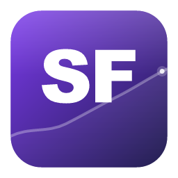

<div align="center">



# StockFilo

**Your portfolio. Your machine. No cloud, no nonsense.**

A blazing-fast, privacy-first desktop app for tracking personal investments — built with Tauri 2 & React 19.

[](LICENSE)
[](https://tauri.app)
[](https://react.dev)
[](https://www.rust-lang.org)

</div>

---

> **StockFilo** combines real-time market data with a beautiful, native desktop experience — without ever sending your financial data to a server. Every position, every purchase, every gain — stored locally on your machine.

---

## ✨ Features at a Glance

### 📊 Dual-Mode Dashboard
Switch between **Novice** and **Advanced** modes to match your experience level — no clutter, no confusion.

| Novice Mode | Advanced Mode |
|---|---|
| Plain-English labels with helpful tooltips | Full suite of professional metrics |
| Portfolio Health indicator (diversification score) | Concentration risk analysis |
| Winners vs. Losers count card | 10-column sortable table with all data |
| Simplified 5-column holdings view | Asset Allocation breakdown by type |

### 📈 Deep-Dive Analysis
Click any ticker for a full per-position breakdown:

- **Mountain chart** with 8 time ranges — `1D · 5D · 1M · 6M · YTD · 1Y · 5Y · MAX`
- **Live news feed** — latest articles pulled for each ticker
- **Cost basis overlay** — visualize where your average entry price sits against the price curve
- **Drag-to-reorder favorites** — pin your most important holdings to the top
- **Google Finance integration** — one click opens the ticker in your browser

### 👀 Smart Watchlist
Never miss a move on stocks you're tracking but haven't bought yet:

- **Live search-as-you-type** — finds tickers by name or symbol via Yahoo Finance
- **Keyboard navigation** — arrow keys, Enter, Escape all work in the dropdown
- **One-click buy** — purchase directly from the watchlist when you're ready

### 💼 Portfolio Management
Accurately track your positions across stocks, ETFs, mutual funds, and crypto:

- Log purchases with shares, price per share, and purchase date
- Automatic **unrealized P&L** calculation (dollar and percent)
- **Daily change %** for every position
- Cost basis tracking across multiple purchases of the same ticker

### ⚙️ Settings & Data Control
You own your data — completely:

- **Export to CSV** — save your purchases any time
- **Import from CSV** — restore or migrate from another tool
- **Theme support** — System / Light / Dark, persisted automatically
- **Dashboard mode** persisted per device

---

## 🖥️ Screenshots

> **Coming soon** — drop your own screenshots in `docs/screenshots/` and reference them here.

<!-- 


-->

---

## 🏗️ Tech Stack

| Layer | Technology |
|---|---|
| **Desktop shell** | [Tauri 2](https://tauri.app) (Rust) |
| **UI framework** | [React 19](https://react.dev) + [TypeScript 6](https://www.typescriptlang.org) |
| **Styling** | [Tailwind CSS 4](https://tailwindcss.com) |
| **Components** | [Radix UI](https://www.radix-ui.com) primitives |
| **Charts** | [Recharts 3](https://recharts.org) |
| **Icons** | [Lucide React](https://lucide.dev) |
| **Database** | SQLite via `tauri-plugin-sql` (local, no server) |
| **Market data** | Yahoo Finance (fetched natively via Rust `reqwest`) |
| **Build tool** | [Vite 8](https://vitejs.dev) |

---

## 🔒 Privacy First

StockFilo makes **zero network requests from your browser**. All market data fetching happens in the Rust backend process and is stored in a local SQLite database on your machine. No accounts. No telemetry. No cloud sync. Your portfolio data never leaves your device.

---

## 🚀 Getting Started

See **[SETUP.md](SETUP.md)** for the full development environment setup guide.

**Quick start for developers:**

```bash
# 1. Clone the repo
git clone https://github.com/MTGMAD/StockFilo.git
cd StockFilo

# 2. Install JS dependencies
npm install

# 3. Run in development mode
npm run tauri dev
```

---

## 📦 Building for Production

```bash
npm run tauri build
```

Output installers are placed in `src-tauri/target/release/bundle/`.

---

## 🤝 Contributing

Pull requests are welcome. For major changes, open an issue first to discuss what you'd like to change.

1. Fork the repository
2. Create your feature branch (`git checkout -b feature/amazing-feature`)
3. Commit your changes (`git commit -m 'Add amazing feature'`)
4. Push to the branch (`git push origin feature/amazing-feature`)
5. Open a Pull Request

---

## 📄 License

Distributed under the ISC License. See [LICENSE](LICENSE) for more information.

---

<div align="center">

Made with ♥ using Tauri + React + Rust

</div>
