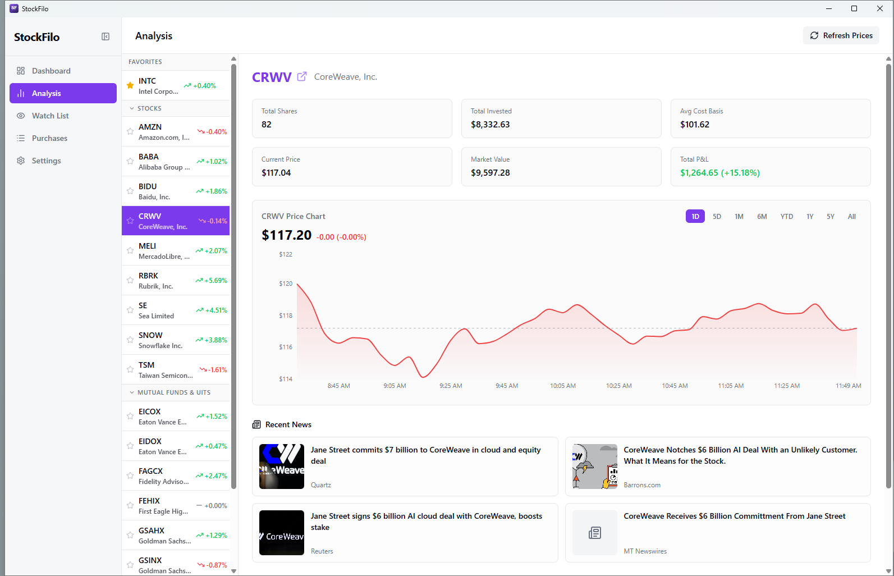
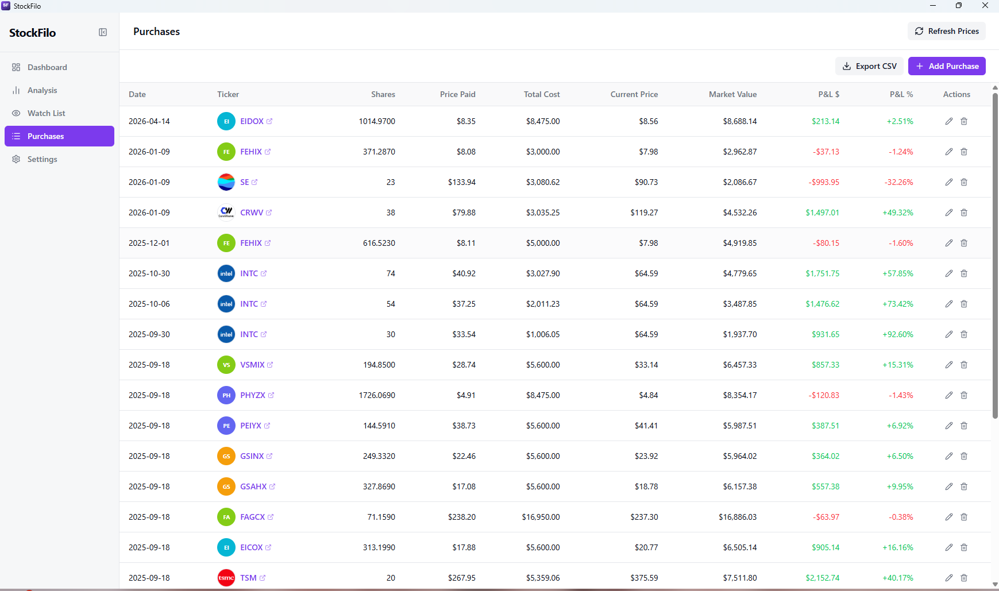

<div align="center">


# Stockfolio

**Your portfolio. Your machine. Sync on your terms.**

A blazing-fast, privacy-first desktop app for tracking personal investments — built with Tauri 2 & React 19.

[](LICENSE)
[](https://tauri.app)
[](https://react.dev)
[](https://www.rust-lang.org)

</div>

---

> **Stockfolio** combines real-time market data with a beautiful, native desktop experience — without ever sending your financial data to a server. Every position, every purchase, every gain — stored locally on your machine.

---

## 🖥️ Screenshots

**Dashboard** — Novice mode with portfolio health, winners/losers, and holdings breakdown:


**Analysis** — Per-ticker price chart, cost basis overlay, P&L metrics, and live news:



**Watch List** — Track tickers before buying, with sparklines, target price alerts, and notes:


**Purchases** — Full purchase log with live P&L, market value, and daily change:



---

## ✨ Features at a Glance

### 📁 Multiple Portfolios

Organize your investments into as many named portfolios as you like:

- Create, rename, star, and delete portfolios
- Reorder the portfolio list in the sidebar
- Each portfolio maintains its own holdings, purchases, and settings independently

### 📊 Dual-Mode Dashboard

Switch between **Novice** and **Advanced** modes to match your experience level — no clutter, no confusion.

| Novice Mode | Advanced Mode |
| --- | --- |
| Plain-English labels with helpful tooltips | Full suite of professional metrics |
| Portfolio Health indicator (diversification score) | Concentration risk analysis |
| Winners vs. Losers count card | 10-column sortable table with all data |
| Simplified 5-column holdings view | Asset Allocation breakdown by type |

### 📈 Deep-Dive Analysis

Click any ticker for a full per-position breakdown:

- **Mountain chart** with 8 time ranges — `1D · 5D · 1M · 6M · YTD · 1Y · 5Y · MAX`
- **Cost basis overlay** — visualize your average entry price against the price curve
- **Live news feed** — latest articles pulled via Yahoo Finance RSS for each ticker
- **Upcoming earnings** — detects earnings dates and generates a one-click calendar invite (`.ics`)
- **Drag-to-reorder favorites** — pin your most important holdings to the top
- **Yahoo Finance link** — one click opens the ticker in your browser or in an in-app window

### 👀 Smart Watchlists

Organize pre-buy research across **multiple named watchlists**:

- Create, rename, reorder, and delete watchlists
- **Live search-as-you-type** — finds tickers by name or symbol via Yahoo Finance
- **Keyboard navigation** — arrow keys, Enter, Escape all work in the dropdown
- **Sparkline mini-charts** — quick at-a-glance price trend per watchlist item
- **Target price** — shows analyst mean price estimate alongside your watch price
- **Notes** — attach free-text notes to any watchlist item
- **Extended hours indicators** — pre-market and post-market price tags
- **One-click buy** — purchase directly from the watchlist when you're ready
- **Backup & restore** — export/import entire watchlists to CSV

### 💼 Portfolio Management

Accurately track your positions across stocks, ETFs, mutual funds, and crypto:

- Log purchases with shares, price per share, and purchase date
- Automatic **unrealized P&L** calculation (dollar and percent)
- **Daily change %** for every position
- **Extended hours pricing** — pre-market and post-market prices with market-state indicators
- Cost basis tracking across multiple purchases of the same ticker

### 📊 Performance Ranking

See your entire portfolio sorted by what matters most:

- Rank all positions by **unrealized gain/loss** — dollar or percent
- Instantly spot your best and worst performers across every holding
- Color-coded gain/loss bars for fast visual scanning

### 🔄 Storage & Sync

Keep your database wherever you want and sync across devices — entirely on your own infrastructure:

- **Custom database location** — move the SQLite file to any local folder, mapped drive, or cloud-synced folder (OneDrive, Google Drive, Dropbox, etc.)
- **Local / network path sync** — copy the database to a NAS, SMB share, or any folder on your network
- **WebDAV / cloud sync** — sync directly to Nextcloud, ownCloud, or any WebDAV server using app passwords
- **Auto-sync on a schedule** — every 5, 15, 30, or 60 minutes while the app is open
- **Manual sync button** — trigger a sync any time from the header, with inline last-synced timestamp
- **Conflict resolution** — newer database always wins; remote is backed up before overwrite
- **Lock file protection** — prevents two devices from writing simultaneously
- No third-party accounts, no proprietary cloud service, no subscription

### ⚙️ Settings & Data Control

You own your data — completely:

- **Export to CSV or Excel (XLSX)** — save your purchases any time
- **Import from CSV or Excel (XLSX)** — restore or migrate from another tool
- **Ameriprise CSV import** — dedicated import for Ameriprise account exports
- **Watchlist backup/restore** — export and import watchlists via CSV
- **Theme support** — System / Light / Dark / Warm, persisted automatically
- **Dashboard mode** persisted per device
- **Link open mode** — open Yahoo Finance links in your default browser or in a focused in-app window (no address bar)
- **Info tooltips toggle** — show or hide contextual help labels

---

## 🏗️ Tech Stack

| Layer | Technology |
| --- | --- |
| **Desktop shell** | [Tauri 2](https://tauri.app) (Rust) |
| **UI framework** | [React 19](https://react.dev) + [TypeScript 6](https://www.typescriptlang.org) |
| **Styling** | [Tailwind CSS 4](https://tailwindcss.com) |
| **Components** | [Radix UI](https://www.radix-ui.com) primitives |
| **Charts** | [Recharts 3](https://recharts.org) |
| **Icons** | [Lucide React](https://lucide.dev) |
| **Spreadsheet** | [SheetJS (xlsx)](https://sheetjs.com) |
| **Database** | SQLite via `rusqlite` (Rust-native, bundled, no server) |
| **Sync transport** | `reqwest` — HTTP WebDAV PUT/GET + local file copy |
| **Market data** | Yahoo Finance (fetched natively via Rust `reqwest`) |
| **News** | Yahoo Finance RSS (parsed via Rust `rss` crate) |
| **Build tool** | [Vite 8](https://vitejs.dev) |

---

## 🔒 Privacy First

Stockfolio makes **zero network requests from your browser**. All market data fetching happens in the Rust backend process and is stored in a local SQLite database on your machine. No accounts. No telemetry.

**Sync is entirely optional and self-hosted.** If you enable it, your database is copied directly between devices via a path or WebDAV server you control — no Stockfolio servers are ever involved. The sync feature works with your own NAS, Nextcloud instance, or any WebDAV-compatible service.

---

## 🚀 Getting Started

See **[SETUP.md](SETUP.md)** for the full development environment setup guide.

**Quick start for developers:**

```bash
# 1. Clone the repo
git clone https://github.com/MTGMAD/StockFilo.git
cd StockFilo

# 2. Install JS dependencies
npm install

# 3. Run in development mode
npm run tauri dev
```

---

## 📦 Building for Production

```bash
npm run tauri build
```

Output installers are placed in `src-tauri/target/release/bundle/`.

---

## 🤝 Contributing

Pull requests are welcome. For major changes, open an issue first to discuss what you'd like to change.

1. Fork the repository
2. Create your feature branch (`git checkout -b feature/amazing-feature`)
3. Commit your changes (`git commit -m 'Add amazing feature'`)
4. Push to the branch (`git push origin feature/amazing-feature`)
5. Open a Pull Request

---

## 📄 License

Distributed under the ISC License. See [LICENSE](LICENSE) for more information.

---

<div align="center">

Made with ♥ using Tauri + React + Rust

</div>
